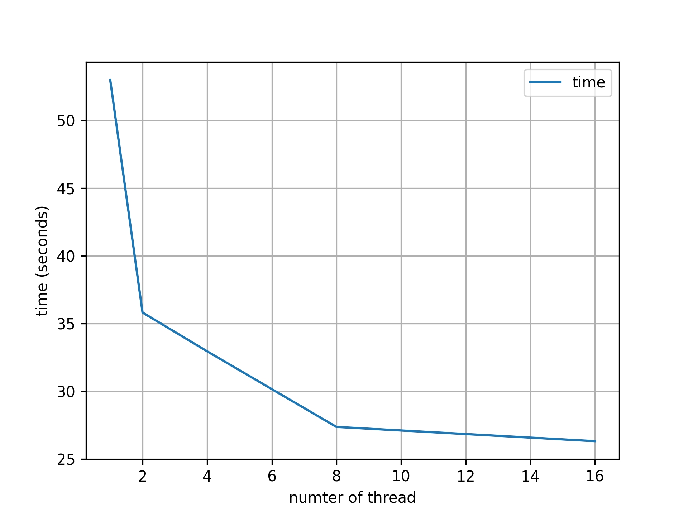

# SEMIC-cpp

This repository wraps up SEMIC (Surface Energy and Mass balance model of Intermediate Complexity; Krapp et al., 2017) in C++.

The original SEMIC written in `Fortran` is available at following site: `https://github.com/mkrapp/semic`.

# Install

## Required Packages in python

* `pybind11` - for compiling SEMIC written in  `cpp`.
* `numpy`
* `matplotlib`

## Install

* To install the `pySEMIC.cpp` for running SEMIC written in cpp (SEMIC-cpp), use following command.
* This work is only tested in `linux` machine, `not window` machine.

```bash
cwd = $(pwd)
mkdir build
cd build
cmake ../ -L -DCMAKE_INSTALL_PREFIX=${cwd}/../install
make 
make install
```

## Window system

* Require Miscrotsoft Visual C++ 14.0 or greater.
* Download https://visualstudio.microsoft.com/visual-cpp-build-tools/
* Install `developement` verison of current project as follows:
* Window 10 > Visual Studio 2019
* Window 11 > Visual Studio 2019 or 2022

```
pip install -e .
```

# Usage

```python
import pyseb

% initialize variable
nx = 100 # number of grid
ntime = 365 # number of timestep in day

semic = pyseb.SEMIC()
semic.Initialize(nx)

```

# Check runtime with using OpenMP



Figure. Runtime of SEMIC depending on number of threads using OpenMP. To operate testing runtime, SIMBA machine is used.


# References

* Krapp, M., Robinson, A., and Ganopolski, A.: SEMIC: an efficient surface energy and mass balance model applied to the Greenland ice sheet, The Cryosphere, 11, 1519–1535, [https://doi.org/10.5194/tc-11-1519-2017](https://doi.org/10.5194/tc-11-1519-2017), 2017.
*
